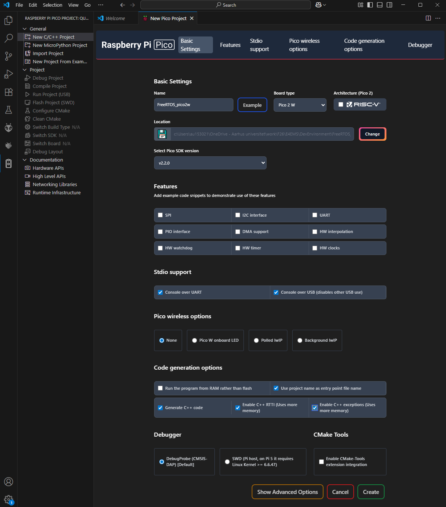
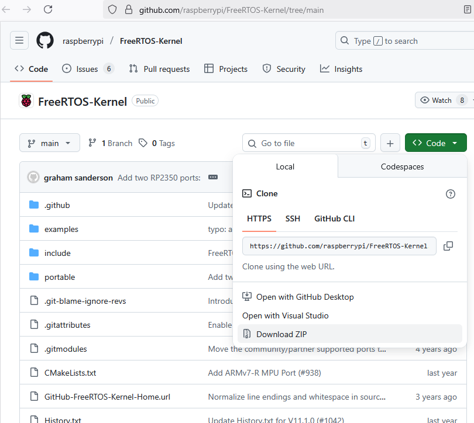

# Start a basic FreeRTOS program
## Create an empty project
Create an empty project in VS Code using the Raspberry Pi Pico plugin.
We'll name the project ``FreeRTOS_pico2w`` (this name will be used later when editing the ``CMakeList.txt``).


In this example, I have included stdio support on both UART and USB, because I use another RPi Pico 2w as debugger and want stdio on the UART, which is relayed by the debugger to the virtual COM port on my PC.  
For now, don't enable C++ exceptions - they will cause the debugger not to enter ``main()``.

## Download the RP2350 FreeRTOS port
Download the [FreeRTOS RP2350 port](https://github.com/raspberrypi/FreeRTOS-Kernel/blob/main/portable/ThirdParty/GCC/RP2350_ARM_NTZ/README.md
) from:
https://github.com/raspberrypi/FreeRTOS-Kernel/tree/main


You can either clone the repo or download a zip.

## Add FreeRTOS to the project
First copy the ``FreeRTOS-Kernel-main`` folder to the project you created.

Then copy the file ``FreeRTOS-Kernel-main\portable\ThirdParty\GCC\RP2350_ARM_NTZ\FreeRTOS_Kernel_import.cmake`` to the root of the project, where the ``CMakeList.txt`` file is.

### Modify the CMakeList.txt
Add the following to the ``CMakeList.txt`` file to include the file you just copied and let CMake know, where the FreeRTOS files are located.
```c
# Add FreeRTOS
set(FREERTOS_KERNEL_PATH "${CMAKE_CURRENT_LIST_DIR}/FreeRTOS-Kernel-main")
include(FreeRTOS_Kernel_import.cmake)

# FREERTOS: FreeRTOSConfig.h needs to be in the include path
target_include_directories(FreeRTOS_pico2w PRIVATE ${CMAKE_CURRENT_LIST_DIR})

# Add the FreeRTOS library to the build
target_link_libraries(FreeRTOS_pico2w
        FreeRTOS-Kernel-Heap4
)
```
### Add FreeRTOS configuration file
Download the files ``FreeRTOSConfig.h`` and ``FreeRTOSConfig_examples_common.h`` from https://github.com/raspberrypi/pico-examples/tree/master/freertos and add them to the root of the project.

### Add support for static allocation
In embedded systems, we are often required to use static allocation of memory. This needs to be enabled in ``in FreeRTOSConfig_examples_common.h``
Find and edit the following section:
```c
/* Memory allocation related definitions. */
#ifndef configSUPPORT_STATIC_ALLOCATION
#define configSUPPORT_STATIC_ALLOCATION         1
#endif
#ifndef configSUPPORT_DYNAMIC_ALLOCATION
#define configSUPPORT_DYNAMIC_ALLOCATION        1
#endif
```

Now we have to provide FreeRTOS with the required functions to provide static memory for IdleTask, PassiveIdleTask and TimerTask. Use the file from: https://github.com/carlk3/FreeRTOS-FAT-CLI-for-RPi-Pico/blob/master/src/FreeRTOS%2BFAT%2BCLI/src/freertos_callbacks.c

Add the ``freertos_callbacks.c`` to the list of files in the add_executable section of the CMakeList.txt:
```c
# Add executable. Default name is the project name, version 0.1
add_executable(FreeRTOS_pico2w FreeRTOS_pico2w.cpp freertos_callbacks.c)
```

The ``freertos_callbacks.c`` has a section, which includes RP2040.h and RP2350.h, but those files are not found in the source code we use, so comment that section out.
```c
/*
#if PICO_RP2040
#  include "RP2040.h"
#endif
#if PICO_RP2350
#  include "RP2350.h"
#endif
*/
```

## Create a basic FreeRTOS program
Use the one from https://github.com/raspberrypi/FreeRTOS-Kernel/blob/main/examples/cmake_example/main.c

Modify the code to add initialization of stdio to the main method and printf a message from the task loop. Like this:
```c
static void exampleTask( void * parameters )
{
    /* Unused parameters. */
    ( void ) parameters;

    for( ; ; )
    {
        printf("Task 1\r\n");
        /* Example Task Code */
        vTaskDelay( 100 ); /* delay 100 ticks */
    }
}
/*-----------------------------------------------------------*/

int main()
{
    stdio_init_all();

    static StaticTask_t exampleTaskTCB;
    static StackType_t exampleTaskStack[ configMINIMAL_STACK_SIZE ];

    printf( "Example FreeRTOS Project\n" );

    xTaskCreateStatic( exampleTask,
                                "example",
                                configMINIMAL_STACK_SIZE,
                                NULL,
                                configMAX_PRIORITIES - 1U,
                                &( exampleTaskStack[ 0 ] ),
                                &( exampleTaskTCB ) );

    /* Start the scheduler. */
    vTaskStartScheduler();

    for( ; ; )
    {
        /* Should not reach here. */
    }

    return 0;
}
```
Compile, run and open the Serial Monitor in VS Code (or another terminal program). You should now see the program starting and the message from the task.


## Optional: Set optimization level
The compiler sometimes opmizes the code in a way, where code is removed or restructured. This can make the debugging session a bit wierd. To disable this, open the CMakeLists.txt file in the project and add the following section, which will disable optimization (e.g. set the compiler flag -O0 and prevent inlining of code):
```
target_compile_options(blink PRIVATE -O0 -g -fno-inline -fno-inline-functions)
```
after the  ``target_link_libraries(blink pico_stdlib)`` section.

## Optional: Cleanup the source tree


# Sources and related documentation
- Raspberry Pi FreeRTOS examples https://github.com/raspberrypi/FreeRTOS-Kernel/tree/main/examples
- Raspberry Pi FreeRTOS pico examples https://github.com/raspberrypi/pico-examples/tree/master/freertos
- RP2350 FreeRTOS port https://github.com/raspberrypi/FreeRTOS-Kernel/tree/main/portable/ThirdParty/GCC/RP2350_ARM_NTZ
- Official RP2350 microcontroller datasheet (1380 pages): https://datasheets.raspberrypi.com/rp2350/rp2350-datasheet.pdf
- RPi Pico documentation https://www.raspberrypi.com/documentation/microcontrollers/pico-series.html#pico-2-family
- PRi Pico SDK https://www.raspberrypi.com/documentation/microcontrollers/c_sdk.html#sdk-setup
- Pico layout and pinout: https://www.raspberrypi.com/documentation/microcontrollers/pico-series.html
- C-sdk datasheet: https://datasheets.raspberrypi.com/pico/raspberry-pi-pico-c-sdk.pdf


